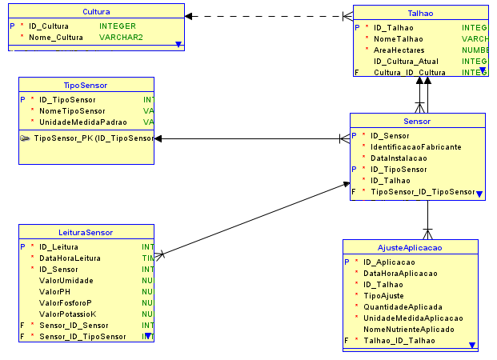

# Modelagem de Dados - FarmTech Solutions - Agricultura Digital

## Integrantes do Grupo

*   Diogo Leite Zequini Pinto - RM565535
*   (Adicionar outros integrantes, se houver)

## Introdução

Este repositório contém a modelagem de dados (MER e DER) para o sistema de gestão agrícola da FarmTech Solutions. O objetivo é armazenar e analisar dados coletados por sensores de umidade, pH e nutrientes (P&K) em diferentes talhões de cultivo, permitindo otimizar a aplicação de água e fertilizantes.

## Modelo Entidade-Relacionamento (MER) Descritivo

A seguir, descrevemos as entidades, atributos e relacionamentos do modelo lógico.

### Entidade: Cultura
*   **ID_Cultura**: Integer (PK) - Identificador único da cultura.
*   **Nome_Cultura**: Varchar(100) (Mandatory, Unique) - Nome da cultura (ex: Milho, Soja).

### Entidade: Talhao
*   **ID_Talhao**: Integer (PK) - Identificador único do talhão.
*   **NomeTalhao**: Varchar(150) (Mandatory, Unique) - Identificação descritiva do talhão.
*   **AreaHectares**: Numeric(10, 2) (Mandatory) - Área do talhão em hectares.
*   **ID_Cultura_Atual**: Integer (FK -> Cultura.ID_Cultura, Nullable) - Identificador da cultura atualmente plantada no talhão (pode estar vazio).

### Entidade: TipoSensor
*   **ID_TipoSensor**: Integer (PK) - Identificador único do tipo de sensor.
*   **NomeTipoSensor**: Varchar(50) (Mandatory, Unique) - Nome do tipo de sensor (ex: 'Umidade', 'pH', 'Nutrientes P&K').
*   **UnidadeMedidaPadrao**: Varchar(20) (Mandatory) - Unidade de medida padrão para as leituras deste tipo de sensor (ex: '%', 'pH', 'ppm').

### Entidade: Sensor
*   **ID_Sensor**: Integer (PK) - Identificador único do dispositivo sensor físico.
*   **IdentificacaoFabricante**: Varchar(100) (Mandatory) - Código ou número de série do fabricante do sensor.
*   **DataInstalacao**: Date (Mandatory) - Data em que o sensor foi instalado no talhão.
*   **ID_TipoSensor**: Integer (FK -> TipoSensor.ID_TipoSensor, Mandatory) - Identificador do tipo de sensor.
*   **ID_Talhao**: Integer (FK -> Talhao.ID_Talhao, Mandatory) - Identificador do talhão onde o sensor está instalado.

### Entidade: LeituraSensor
*   **ID_Leitura**: Integer (PK) - Identificador único de uma leitura de sensor.
*   **DataHoraLeitura**: Timestamp (Mandatory) - Data e hora exata em que a leitura foi realizada.
*   **ID_Sensor**: Integer (FK -> Sensor.ID_Sensor, Mandatory) - Identificador do sensor que realizou a leitura.
*   **ValorUmidade**: Numeric(5, 2) (Nullable) - Valor lido, se for um sensor de umidade.
*   **ValorPH**: Numeric(4, 2) (Nullable) - Valor lido, se for um sensor de pH.
*   **ValorFosforoP**: Numeric(10, 2) (Nullable) - Valor de Fósforo (P) lido, se for um sensor de nutrientes.
*   **ValorPotassioK**: Numeric(10, 2) (Nullable) - Valor de Potássio (K) lido, se for um sensor de nutrientes.

### Entidade: AjusteAplicacao
*   **ID_Aplicacao**: Integer (PK) - Identificador único de uma ação de ajuste (aplicação).
*   **DataHoraAplicacao**: Timestamp (Mandatory) - Data e hora exata em que o ajuste foi realizado.
*   **ID_Talhao**: Integer (FK -> Talhao.ID_Talhao, Mandatory) - Identificador do talhão que recebeu a aplicação.
*   **TipoAjuste**: Varchar(20) (Mandatory) - Tipo de ajuste realizado (ex: 'Agua', 'Nutriente').
*   **QuantidadeAplicada**: Numeric(10, 2) (Mandatory) - Quantidade do produto aplicado.
*   **UnidadeMedidaAplicacao**: Varchar(20) (Mandatory) - Unidade de medida da quantidade aplicada (ex: 'Litros', 'Kg').
*   **NomeNutrienteAplicado**: Varchar(100) (Nullable) - Nome específico do nutriente aplicado, se TipoAjuste for 'Nutriente'.

### Relacionamentos
*   **Cultura (1) -- (0,N) Talhao:** Uma cultura pode estar plantada em zero ou muitos talhões. Um talhão pode ter opcionalmente uma cultura associada. (FK: Talhao.ID_Cultura_Atual)
*   **TipoSensor (1) -- (1,N) Sensor:** Um tipo de sensor pode ser associado a um ou muitos sensores físicos. Um sensor pertence obrigatoriamente a um tipo. (FK: Sensor.ID_TipoSensor)
*   **Talhao (1) -- (1,N) Sensor:** Um talhão pode ter um ou muitos sensores instalados. Um sensor pertence obrigatoriamente a um talhão. (FK: Sensor.ID_Talhao)
*   **Talhao (1) -- (1,N) AjusteAplicacao:** Um talhão pode receber uma ou muitas aplicações/ajustes. Uma aplicação pertence obrigatoriamente a um talhão. (FK: AjusteAplicacao.ID_Talhao)
*   **Sensor (1) -- (1,N) LeituraSensor:** Um sensor pode gerar uma ou muitas leituras. Uma leitura pertence obrigatoriamente a um sensor. (FK: LeituraSensor.ID_Sensor)

## Diagrama Entidade-Relacionamento (DER) Físico

A imagem abaixo representa o modelo relacional físico gerado para Oracle SQL Developer Data Modeler:

